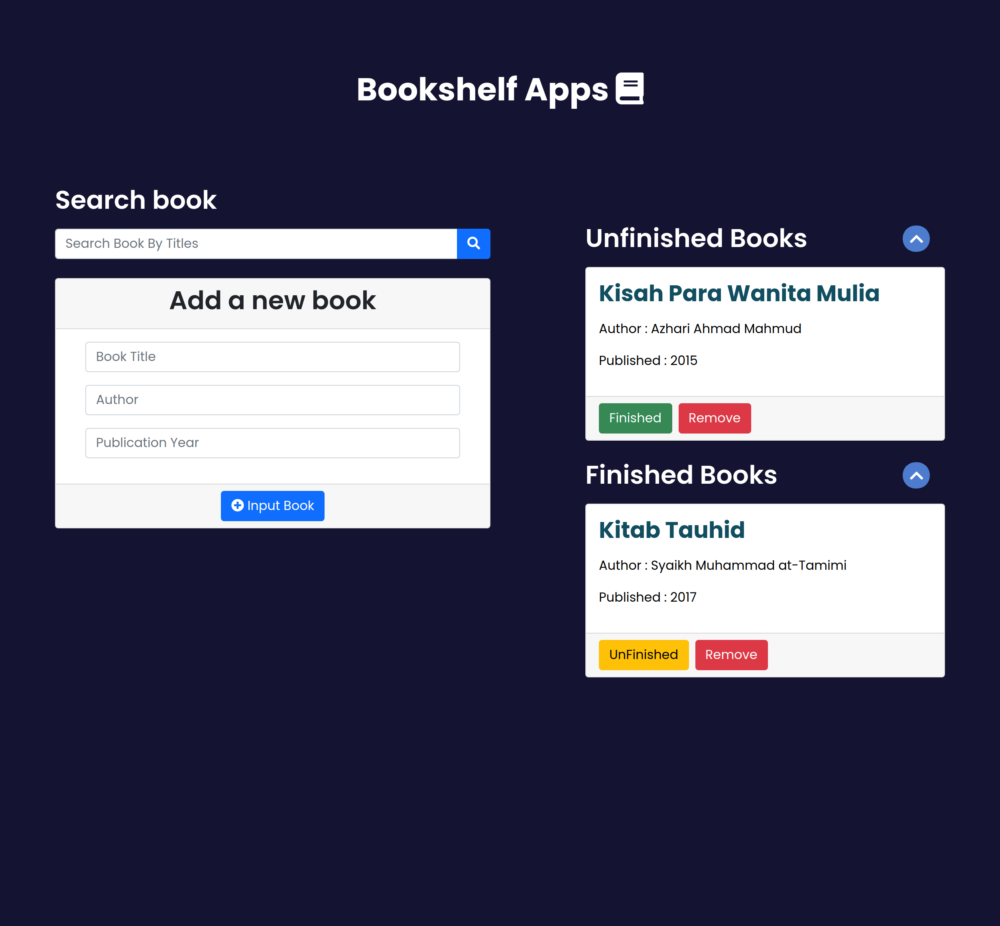
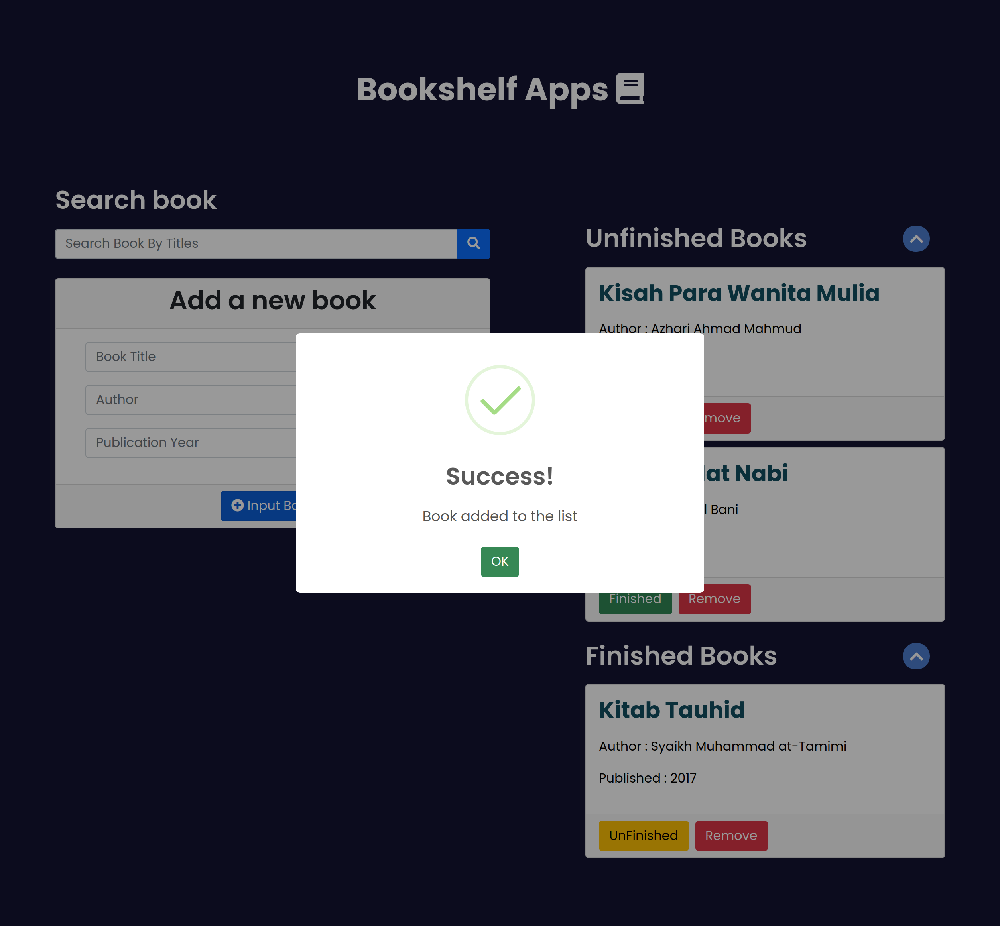
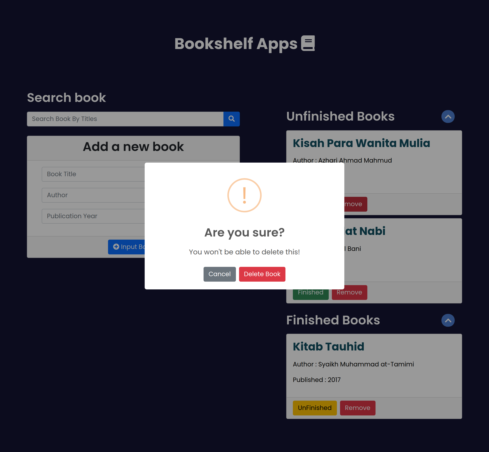

# Submission-bookshelf_js-dicoding
Submission Kelas Belajar Membuat Front-End Web untuk Pemula on Dicoding

Hallo All, 
Ini Submission Kelas <b>"Belajar Membuat Front-End Web untuk Pemula"</b> Dicoding 
Kalian bisa lihat code ini sebagai referensi untuk penugasan <b>Submission</b> di Dicoding. 

Berikut Priview Front-End Web Dasar.  
</img>
  
</img>
  
</img>
  
<b>Terima Kasih!</b>
